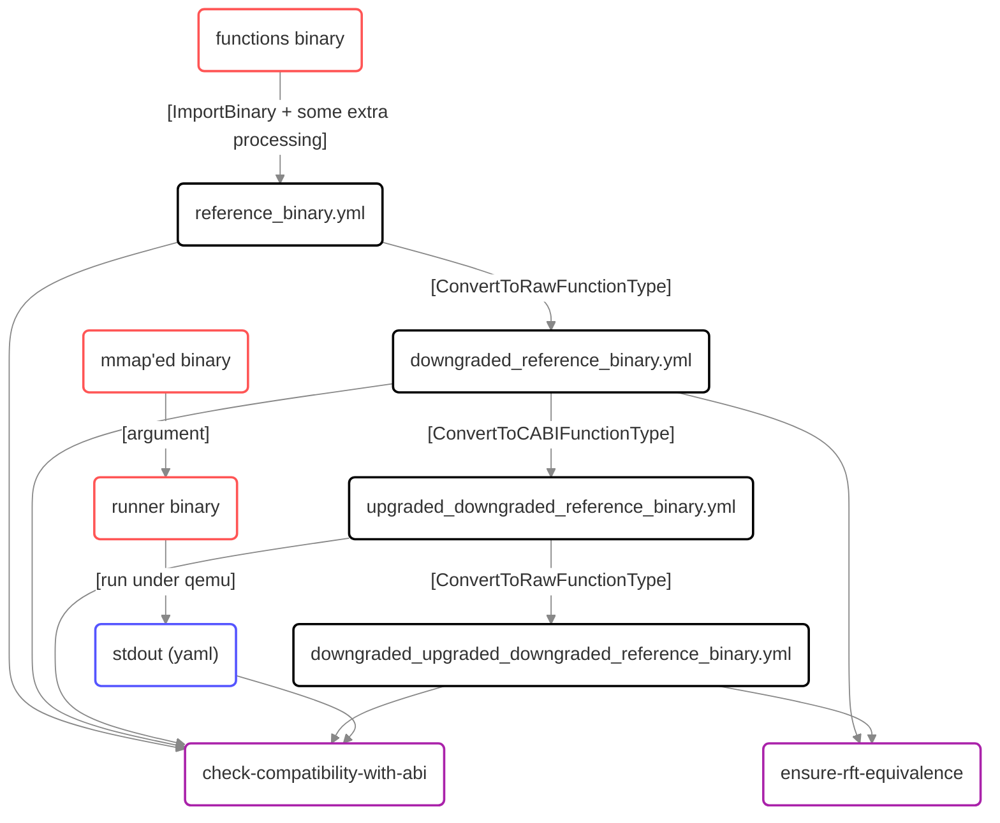
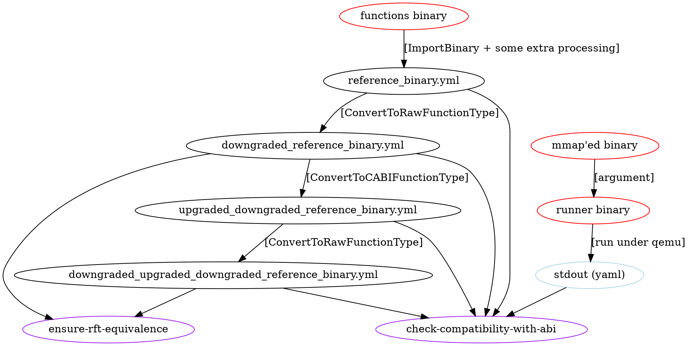

# The structure of `test.sh` scripts.

For a more complete overview of the entire testing suite see the [`scripts/abi_artifact_generator/end_to_end.md`](https://github.com/revng/revng-qa/blob/develop/scripts/abi_artifact_generator/end_to_end.md) in the `revng-qa` repository.

Only the the scripts provided in this directory are explained here.

  
(graphviz)

Legend:
* red - binary output of a compiler.
* blue - output of the `"runner binary"`.
* purple - tools from `revng/tests/tools/abi`.
* black - intermediate model files.

## `test-conversion.sh`

The order of the operations done by the pipeline can be found in `test-conversion.sh` (`test-layout.sh` is a stripped down version of that assumes no `raw->cabi` analysis). Let me elaborate a bit further on every command:

### `revng analyze ImportBinary`

The abi testing reference binary is imported into a model using the normal means. The code for generating this "pure" is located in the [revng-qa](https://github.com/revng/revng-qa) repository.

### `python3 replace-abi.py`

Because sometimes it's impossible to detect ABI correctly based on dwarf data alone, and because having the right ABI is _really_ important for the integrity of this test, if for any CABI-FT inside the binary the recorded ABI doesn't exactly match the expected ABI, this script overrides it.

### `revng analyze AddPrimitiveTypes`

Eventually this will have to go away, but for now manually make sure each primitive type is present in the model, to avoid any surprises. Let's call the model after this step a `reference_binary.yml`.

### `revng analyze ConvertToRawFunctionType`

This analysis converts every CABI function within the input model (`reference_binary.yml`) into its "raw" representation. The result is saved into (`downgraded_reference_binary.yml`)

### `revng analyze ConvertToCABIFunctionType`

This pass tries to "upgrade" every "raw" function into its CABI representation knowing the ABI it uses. The result is written to `upgraded_downgraded_reference_binary.yml`.

### `revng analyze ConvertToRawFunctionType`

The same pass is run again to obtain one more set of "raw" functions. Those get written into `downgraded_upgraded_downgraded_reference_binary.yml`.

### `revng ensure-rft-equivalence`

This tool is used to compare `downgraded_reference_binary.yml` and `downgraded_upgraded_downgraded_reference_binary.yml`. If no information was lost during these conversions, the models are to be the same.

Sadly, there are cases where `revng model diff` is not good enough to verify that two instances of a model are the same. Mostly because it relies on the type IDs. So even if there are two identical types generated in different places (they have different IDs because of that), the diff detects these "changes" and fails the check.

To counteract that, use a `CustomName`-first approach. And since there are quirks, it's easier to provide specialized tool (namely `revng ensure-rft-equivalence`) which scouts two separate model files for the functions with a matching `CustomName` and then takes extra care comparing them semantically.

### `revng check-compatibility-with-abi`

As the last step, normal abi verification is run on every single model produced during the course of this test. This makes sure that at no point during the test, the "current" model was incompatible with the real binary it's supposed to represent. The information used to verify comes from running the specially crafted binary that ~~ab~~uses the compiler to generate tests in such a way that we can surely tell where a specific value was placed as a part of the ABI "handshake". To read about it in more details, see the [explanation](https://github.com/revng/revng-qa/blob/develop/scripts/abi_artifact_generator/end_to_end.md) about how it is generated in revng-qa

The artifact provides information that can be used to verify whether a given argument COULD have been passed using a given register. There's no certainty: since all the values are randomly generated, collisions are likely. That's why each function has multiple iterations per artifact. Also that means that artifact is ineffective for restoring the original function signature, but it's good enough to verify whether a known signature corresponds to the factual state.

`revng check-compatibility-with-abi` tool goes through every function present in both the artifact and the model it was passed and and checks the conformity of the data within the model. For example, if the function within the model was fiddled with (its type was changed, for example) and was changed in a non-backwards-compatible way, this could be a good way to detect the problem.
